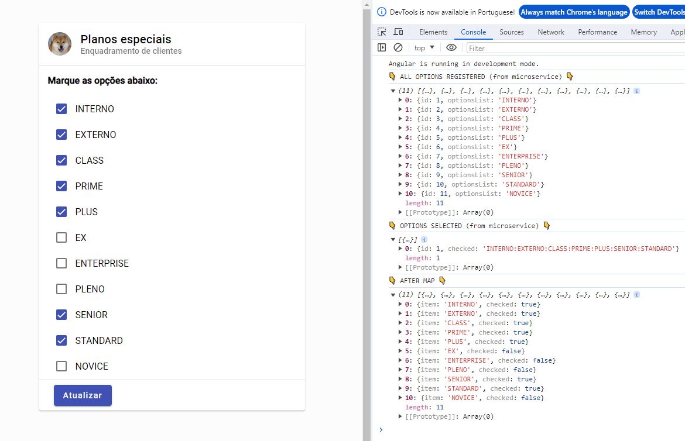
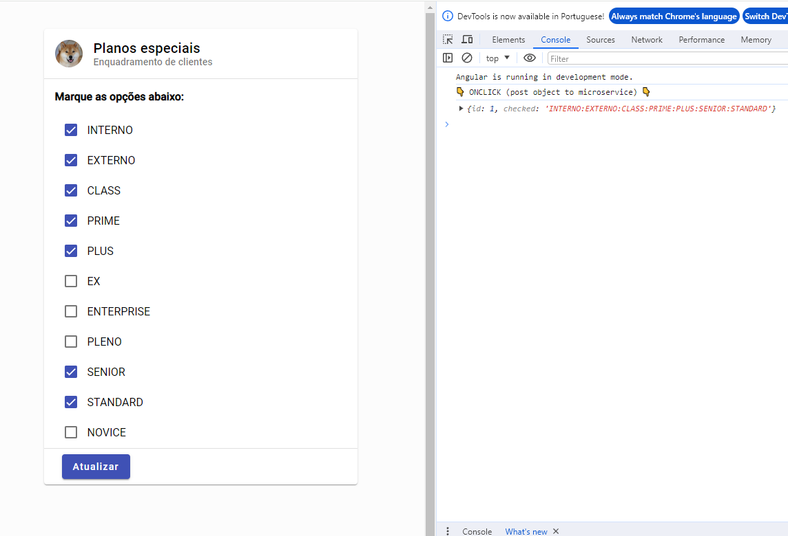

# DynamicCheckboxesFront
Este é um FrontEnd que faz o gerenciamento de checkboxes dinâmicos, os dados são enviados para um backend em springBoot e database em memória H2.


## 🛠 Tecnologias
- Angular 17
- Angular Material 17.1
- Rxjs
- Typescript 5.2.2
- BackEnd Java https://github.com/V1centR/DynamicCheckboxes


## Instalação

Faça o clone do repositório e dentro da pasta DynamicCheckboxesFront execute o comando:

```bash
  npm install
```

Após terminado a execução do install execute:

```bash
  ng serve
```

[](https://www.linkedin.com/in/vicent-ramos-33954ab5/)


## Screenshots






